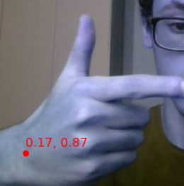
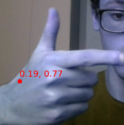
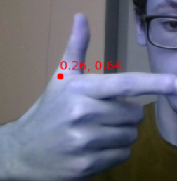
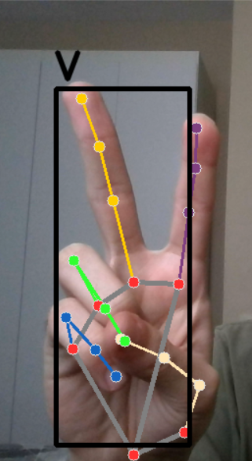
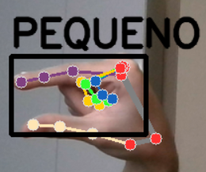
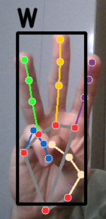
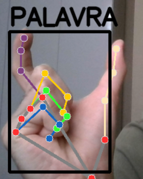

# Sariema_IA
#### Unindo mãos e tecnologia

Este é um projeto de detecção de sinais de Libras usando Python, OpenCV, Scikit Learn (Numpy, Random Forest, etc).

## Visão Geral

O objetivo deste projeto é criar um sistema de detecção de sinais de Libras usando técnicas de visão computacional e aprendizado de máquina. O sistema é capaz de identificar gestos de sinais de Libras feitos com as mãos e traduzi-los.

## Funcionalidades

- Detecção de gestos de sinais de Libras

### Etapa de Detecção de Pontos





### Reconhecimento Final dos Sinais






## Instalação

Para executar este projeto, siga as etapas abaixo:

1. Clone este repositório:

   ```bash
   git clone https://github.com/vinidioli/Sariema_IA.git

2. Instale as dependências:

   ```bash
   pip install -r requirements.txt

3. Licença:

   Este projeto está licenciado sob a [GNU LICENSE] - veja o arquivo LICENSE.md para mais detalhes.


